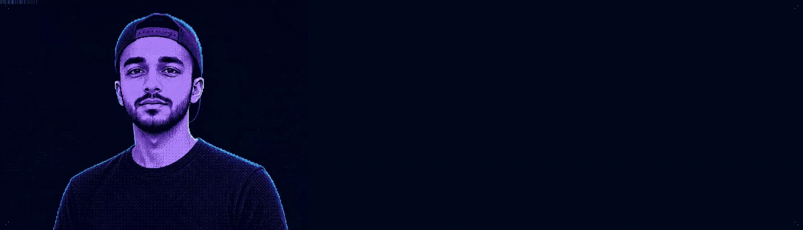

  

  <a href="https://usmanyousaaf.site"><picture><source media="(prefers-color-scheme: dark)" srcset="./assets/btn-website-dark.svg" /></picture></a>
  <a href="https://www.linkedin.com/in/usmanyousaaf"><picture><source media="(prefers-color-scheme: dark)" srcset="./assets/btn-linkedin-dark.svg" /></picture></a>
  <a href="https://huggingface.co/usmanyousaaf"><picture><source media="(prefers-color-scheme: dark)" srcset="./assets/btn-huggingface-dark.svg" /></picture></a>
  <a href="mailto:usmanyousafpersonal@gmail.com"><picture><source media="(prefers-color-scheme: dark)" srcset="./assets/btn-email-dark.svg" /></picture></a>

 

## About Me

I build at the intersection of AI and software engineering — not just to ship features, but to ship systems that think.

I'm a Full-Stack AI Engineer and consultant operating across freelance engagements.

**Focus**
- Deep focus on LLMs, RAG pipelines, AI Agents, and autonomous reasoning systems
- Designing cloud-native, containerized architectures on AWS with Terraform & Kubernetes
- Building production web crawlers, data ingestion platforms, and HITL workflows
- Open to AI engineering problems, consulting engagements, and meaningful collaborations
- AI business consulting & business automation — n8n, GoHighLevel

**Open To:** AI consulting · Full-stack contracts · Agentic system architecture · Freelance automation

 

  <picture>
    <source media="(prefers-color-scheme: dark)" srcset="https://skillicons.dev/icons?i=python,ts,js,cpp,pytorch,fastapi,nodejs,react,nextjs,tailwind,postgres,mongodb,redis,graphql,aws,docker,kubernetes,terraform&amp;theme=dark&amp;perline=18" />
    
  </picture>

  LangChain · LangGraph · Hugging Face · OpenAI · Anthropic · pgvector · Pinecone · FAISS · Playwright · Terraform · GitHub Actions

 

  <picture>
    <source media="(prefers-color-scheme: dark)" srcset="https://raw.githubusercontent.com/osmanyousaaf/osmanyousaaf/output/github-contribution-grid-snake-dark.svg" />
    
  </picture>

  

